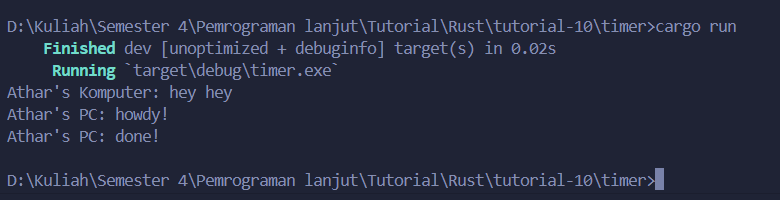
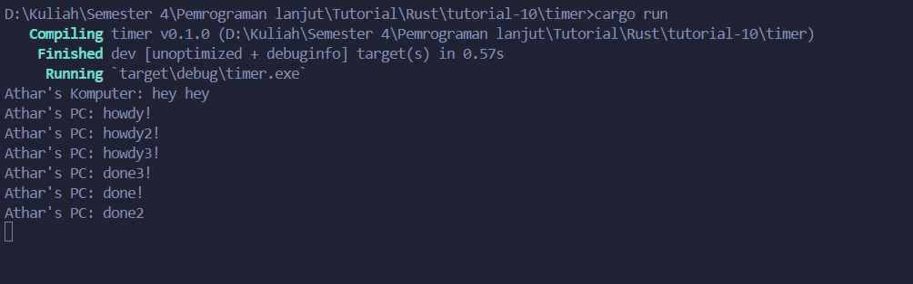
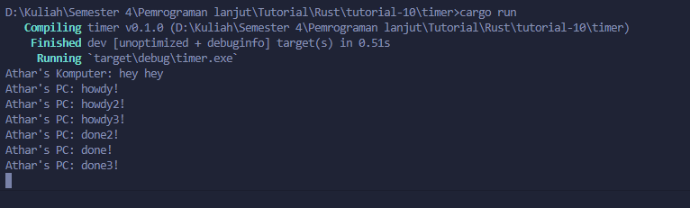
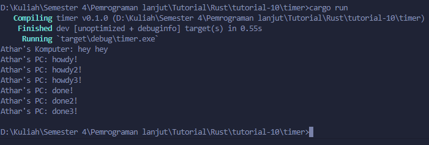

## Nama : Shaquille Athar Adista
## NPM : 2206081875

### 1.2 Understanding how it works.

`Athar's Komputer: hey hey` keluar pertama di output karena `Athar's Komputer: hey hey` berada di luar fungsi async (spawner) sehingga `Athar's Komputer: hey hey` mungkin saja muncul duluan daripada fungsi yang ada di async walaupun fungsi async dijalankan duluan, hal ini dikarenakan sifat dari async yang tidak menghambat jalannya program lain. Pada program diatas alasan `Athar's Komputer: hey hey` keluar duluan adalah dikarenakan program async belum selesai mengeksekusi seluruh kodenya, tetapi karena sifatnya yang async maka kode setelahnya dapat langsung dieksekusi tanpa perlu menunggu selesainya fungsi async.

### 1.3 Multiple Spawn and removing drop

tanpa drop(spawner)

dengan drop(spawner)

Dapat terlihat bahwa jika tanpa drop(spawner) maka program tidak akan terhenti dikarenakan drop(spawner) berfungsi untuk memberitahu executor bahwa sudah tidak ada lagi task yang harus ditambahkan sehingga executor akan menyelesaikan task yang sudah ada, jika tidak ada drop(spawner) maka executor akan terus menunggu adanya task baru di dalam spawner, sehingga dapat terlihat bahwa program tidak akan selesai.

Memanggil banyak spawner akan membuat executor menjalankan banyak task async secara bersamaan (konkuren) sehingga urutan keluarnya pun juga acak, karena spawn yang dijalankan tidak dijamin urutan penyelesaiannya.